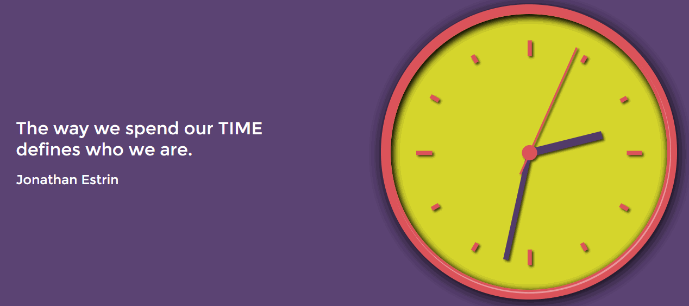

# Analog-Clock
A web application built with HTML, CSS and JavaScript that displays an analog clock with the current time. 
 

 

## __Author__

**Elisabeth Strunk** 
 https://elisabethstrunk.me/ 
 https://github.com/ElisabethStrunk 
 https://www.linkedin.com/in/elisabeth-strunk/ 
 https://twitter.com/Elisabeth57runk 
 https://stackoverflow.com/users/10917711/elisabeth-strunk 

## __Acknowledgements__

* Many thanks to [Morten Rand-Hendriksen](https://www.linkedin.com/in/mortenrandhendriksen) who provides a [*LinkedIn Learning* course](https://www.linkedin.com/learning/javascript-essential-training-3) that was the inspiration for this project.
